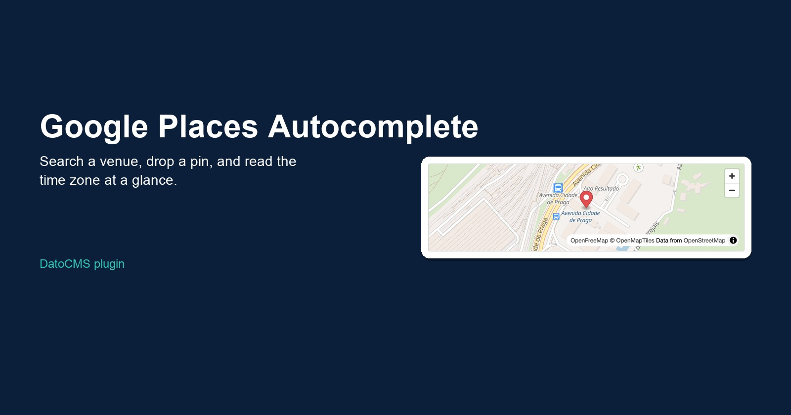
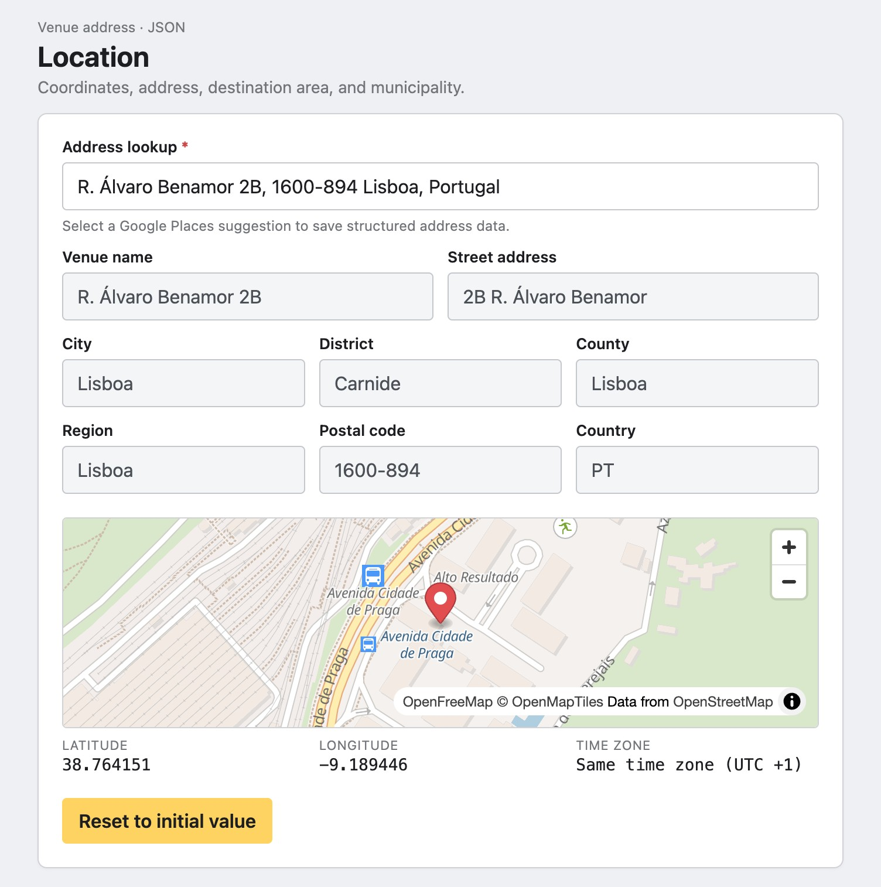

# Google Places Autocomplete



A DatoCMS JSON field that turns a Google Places search into a structured address, a map pin, and a time zone an editor can read at a glance.

Use it for venues, stores, offices, event locations, campuses, or any record that needs a real place instead of a free-text address. The saved JSON keeps street, city, region, postal code, country, coordinates, and UTC offset, so a website can render the address, plot it on a map, or compare the place’s clock with the visitor’s.

This plugin keeps the JSON shape of the original [DatoCMS Address Autocomplete](https://github.com/elevationchurch/datocms-plugin-adress-autocomplete) plugin (v1.2.0, by Ulises Himely / Elevation Church), so existing records stay readable by the same frontend queries. It does not replace that package or its Marketplace listing.

## Demo


The demo starts from a saved Lisbon address with district `Carnide`, then moves to Times Square Church and Sagrada Família. Conditional address rows appear only when Places returns them, the pin and time zone update with each place, and **Reset to initial value** restores the address the record opened with. [Watch the full-quality MP4](https://raw.githubusercontent.com/rodrigobarona/datocms-plugin-places-autocomplete/main/docs/demo.mp4).

On the DatoCMS Marketplace, the same recording plays in the preview above this README. That player comes from `datoCmsPlugin.previewImage` in `package.json`, which points at `docs/demo.mp4` inside the published package. The README itself stays a still image and a GIF, the same split official plugins use.

## What editors see



**Plugin settings.** One required Google Maps API key, saved with an explicit Save button. The parameter name is `mapsAPIKey`.

**Field presentation.** The editor is available only on JSON fields, under the name **Google Places address**. Each field can choose the language Google should prefer for suggestions, and optionally which string/text field should prefill an empty Places lookup (for example Name or Title). Those settings are stored as `{ "label": "…", "value": "…" }` objects.

**Record editor.** A Places lookup sits above a read-only summary of the components Google returned for that place: venue, street, subpremise, neighborhood, sublocality, city, ward, administrative areas, postal code, and country. Empty components stay hidden, so a Portuguese address can show a district without an empty US-style state row, and a US address can show region and county when Places provides them. Under that, a map drops a pin on the saved coordinates. Editors can pan and zoom the map with drag and the +/- controls. Latitude and longitude are shown beside the time zone, written relative to the editor’s own clock:

- **Same time zone (UTC +1)**
- **1 hour ahead (UTC +2)**
- **5 hours behind (UTC -4)**
- **4 hours 30 minutes ahead (UTC +5:30)** when the offset is not a whole hour

Choosing a suggestion writes the JSON immediately. Clearing the lookup writes an empty address and hides the map. **Reset to initial value** restores the address that was loaded when the record form opened and saves that value back to the field.

On focus, the lookup asks for the browser location and biases suggestions toward that area. Location access is optional; search still works if it is denied.

The map uses [OpenFreeMap](https://openfreemap.org/) tiles through [MapLibre GL](https://maplibre.org/), so showing the pin does not call Google’s Maps JavaScript map and is not billed as a Dynamic Map. Pan and zoom are enabled so editors can inspect the neighborhood around the pin.

## Requirements

- A DatoCMS project
- A Google Cloud project with billing enabled
- **Maps JavaScript API** enabled
- **Places API (New)** enabled
- A browser API key

The legacy Places API is not enough. `PlaceAutocompleteElement` needs Places API (New).

## Google API key security

The key is used in the browser. Restrict it in Google Cloud:

1. Set the application restriction to **Websites**.
2. Allow the origin that serves the DatoCMS plugin iframe.
3. Allow the local Vite origin, such as `http://localhost:5173/*`, only while developing.
4. Restrict the key to **Maps JavaScript API** and **Places API (New)**.

Check the iframe origin in the browser network panel before locking the referrer list.

## Install and configure

1. Install **Google Places Autocomplete** in the DatoCMS project.
2. Open the plugin settings and save the Google Maps API key.
3. Create or edit a **JSON** field.
4. Under **Presentation**, set the field editor to **Google Places address**.
5. Choose the results language.
6. Optionally choose **Prefill search from** and pick a string/text field such as Name. When the address is empty, the Places lookup is seeded with that field’s value so editors can open suggestions without retyping.

## Stored value

The field value is pretty-printed JSON:

```json
{
  "street_number": "11701",
  "route": "Elevation Pt Dr",
  "neighborhood": "Ballantyne",
  "locality": "Charlotte",
  "administrative_area_level_2": "Mecklenburg County",
  "administrative_area_level_1": "NC",
  "country": "US",
  "postal_code": "28277",
  "name": "Elevation Church - Ballantyne",
  "formatted_address": "11701 Elevation Pt Dr, Charlotte, NC 28277, USA",
  "coordinates": {
    "lat": 35.02993079999999,
    "lng": -80.8557278
  },
  "utc_offset_minutes": -240
}
```

Component values use Google's short text when it is available, so country stays `US` and a region stays `NC`. The editor shows a standard set of address components (venue, street, neighborhood, locality, administrative areas, postal code, country, and related fields) only when Places returns a value for them. Extra component types that are not part of that form still stay on the saved JSON object.

`utc_offset_minutes` stays a number of minutes from UTC. The friendly sentence is only a display. A frontend can format it the same way, or pass the coordinates to MapLibre, Leaflet, or Google Maps.

## Moving a field from the original plugin

The original plugin stays installed until you change each field. To point a JSON field at this editor:

1. Install and configure this plugin with a key that has Places API (New) enabled.
2. Change the field presentation from **Address** to **Google Places address**.
3. Choose the language again. The original plugin stored the same `{ label, value }` shape.
4. Open a record that already has an address and confirm the summary fields match the saved JSON.

New selections are written in the same key names. Empty or invalid JSON is treated as a blank address.

## Billing

`PlaceAutocompleteElement` manages the autocomplete session. Each selection calls `Place.fetchFields()` for `addressComponents`, `displayName`, `formattedAddress`, `location`, and `utcOffsetMinutes`. That request closes the session and is billed under current Place Autocomplete and Place Details prices. The confirmation map does not add a Google map load. Check Google Maps Platform pricing before production use.

## Development

Node.js 22.12 or newer and pnpm 12.8.1.

```bash
corepack enable
pnpm install
pnpm dev
```

In DatoCMS, add the local Vite URL as a private plugin. The production entry point is `dist/index.html`.

```bash
pnpm check
pnpm outdated
pnpm peers check
```

`pnpm check` runs Oxlint with warnings denied, the unit tests, the TypeScript build, and the Vite production build.

To refresh Marketplace screenshots and the README demo, put a key in `.env.local` as `GOOGLE_MAPS_API_KEY=…`, run `pnpm demo:capture`, open `http://localhost:5174/?capture=1`, and capture from that page.

MapLibre’s worker files are copied into `public/` on install and build, then shipped next to `index.html`, so the map also works from the versioned plugin CDN.

## Publishing

A published GitHub release runs the npm workflow when the `NPM_TOKEN` repository secret is set. The package includes `dist`, the Marketplace images in `marketplace/`, and `docs/demo.mp4`. `datoCmsPlugin.coverImage` is the listing banner. `datoCmsPlugin.previewImage` is the video the Marketplace plays above this README.

## License

MIT. The address JSON contract follows the original [datocms-plugin-address-autocomplete](https://github.com/elevationchurch/datocms-plugin-adress-autocomplete) plugin.
